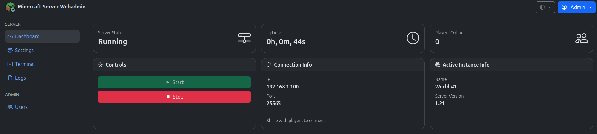
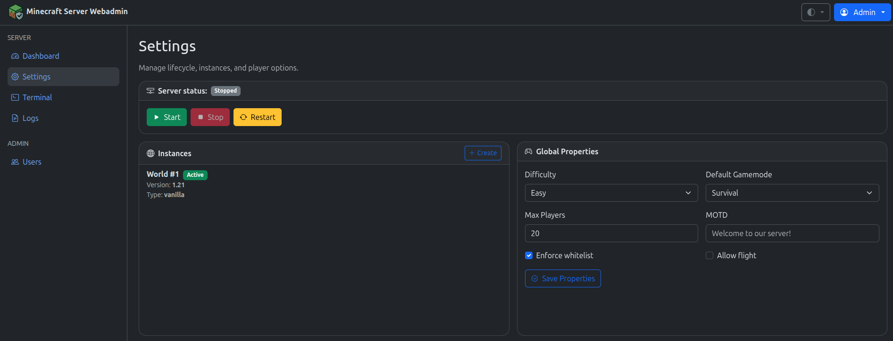
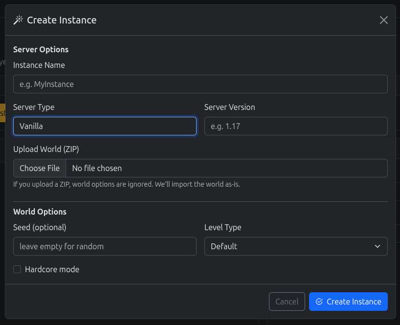

# Minecraft Server WebAdmin

A modern web-based admin panel for managing Minecraft servers, worlds, and player options built with Python.

## Features

- Start, stop, and restart Minecraft servers from the web UI
- Manage multiple worlds: create, activate, and delete worlds
- Change server version and configuration
- Player options: difficulty, gamemode, whitelist, MOTD, and more
- User authentication and role-based access
- View server logs and terminal output
- Responsive, mobile-friendly interface
- Openid Connect authentication support
- Admin CLI for users administration

## Screenshots

### Dashboard


### Settings


### New World


## Quick Start (Docker)

### 1. Deploy container

Docker run command:
```bash
docker run -d \
	-e MCADMIN_DISPLAY_IP=your.public.ip.address \
	-p 8000:8000 \
	-p 25565:25565 \
	-v $(pwd)/data:/data \
	ghcr.io/septi0/mc-server-webadmin:latest
```

OR

Docker compose file:

```yaml
services:
  mc-server-webadmin:
    image: ghcr.io/septi0/mc-server-webadmin:latest
    environment:
      - MCADMIN_DISPLAY_IP=your.public.ip.address
    ports:
      - "8000:8000"
      - "25565:25565"
    volumes:
      - ./data:/data
```

### 2. Configure

Configuration is done via environment variables. Any entry from the config file has it's equivalent as an environment variable, with the format `MCADMIN_<KEY>` for minecraft server related configuration and `MCADMIN_WEB_<KEY>` for web server related configuration.

Common configuration options:

- `MCADMIN_JAVA_MIN_MEMORY`: The minimum amount of memory to allocate to the Java process (default: `1G`)
- `MCADMIN_JAVA_MAX_MEMORY`: The maximum amount of memory to allocate to the Java process (default: `1G`)
- `MCADMIN_DISPLAY_IP`: The IP address to display for connecting to the Minecraft server
- `MCADMIN_WEB_TRUSTED_PROXIES`: Comma-separated list of trusted proxy IPs
- `MCADMIN_WEB_BASE_URL`: The base URL for the web interface (default: `/`)

**Note!** When running the application as a container (or using proxies / port forwarding, etc.), the real IP and port are not directly accessible to the app and it won't display the correct connect information. To fix this, use `MCADMIN_DISPLAY_IP` (or `MCADMIN_DISPLAY_HOST`), and `MCADMIN_DISPLAY_PORT` configuration options.

For details on available configuration options, please refer to the [config.sample.yml](config.sample.yml) file.

### 3. Access the Web UI

Open your browser to [http://localhost:8000](http://localhost:8000)

---

## Local Installation (alternative to Docker installation)

### 1. Clone the repository

```bash
git clone <your-repo-url>
cd mc-server-webadmin
```

### 2. Install dependencies

```bash
python3 -m venv venv
source venv/bin/activate
pip install -r requirements.txt
```

### 3. Configure

```bash
cp config.sample.yml config.yml
```

### 4. Run the server

```bash
python run.py --config config.yml
```

## Running commands via CLI
Check the help for available commands as this feature is still under development.

### Docker installation
```bash
docker exec -it <container-name> mc-server-webadmin users --help
```

### Local installation
```bash
python run.py --config config.yml users --help
```

## Openid Connect

This application supports OpenID Connect (OIDC) for user authentication. OIDC is an authentication layer on top of OAuth 2.0 that allows clients to verify the identity of users based on the authentication performed by an authorization server.

### Configuration

To use OIDC, you need to enable `OpenID Connect Authentication` option in Authentication menu and configure a provider.
After configuration, the `Redirect URI` and `Logout Backchannel URI` will be displayed in the list of providers.

When using the `Auto Launch` option, users will be automatically redirected to the OIDC provider's login page without having to click a login button. In order to use the regular login flow, add `?direct=true` to the login URL.

## Disclaimer

This software is provided as is, without any warranty. Use at your own risk. The author is not responsible for any damage caused by this software.

## License

See [LICENSE](LICENSE).
